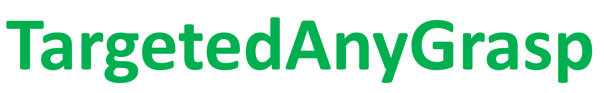

## 🏠 Getting Started

### 🛠️ Installation
To get started, follow the installation steps below. You can install the components locally or use Docker for a streamlined process.

#### 👉 Step 1: Install AnyGrasp
Begin by installing AnyGrasp. The detailed installation instructions can be found [here](Install/Install_AnyGrasp.md).

#### 👉 Step 2: Install SAM
Once AnyGrasp is set up, proceed to install SAM. Follow the instructions provided [here](Install/Install_SAM.md).

### 🔄 Pipeline
Now you can run the code that uses AnyGrasp SDK & Grounded-Light-HQ-SAM.

1. 🔄 **Sampling**
```bash
cd TargetedAnyGrasp
conda activate sam
cd grasp_detection
python sample_realsense.py
# s - save
# q - exit
```
Then you can find the image (RGB+depth) captured in the "out" folder named by timestamps.

2. 🔍 **Query**
```bash
conda activate sam
cd Grounded-Segment-Anything/EfficientSAM
python grounded_light_hqsam.py
```
Then you will get the grounded detection and segmentation results under `./grasp_detection/out/`.

3. 🌀 **Select**
```bash
conda activate sam
cd grasp_detection

# for mask
python select_mask_region.py

# for bounding box
python select_region.py
```

4. ✍️ **Grasp Pose Generation**
```bash
conda activate anygrasp
cd grasp_detection
sh demo_real_query.sh
```
Finally, you will get the `gripper_pose.json`.

## 🎬 Demo
You can run the code for an example scene and the queried case - "bear" (under `./grasp_detection/out/1/`).
